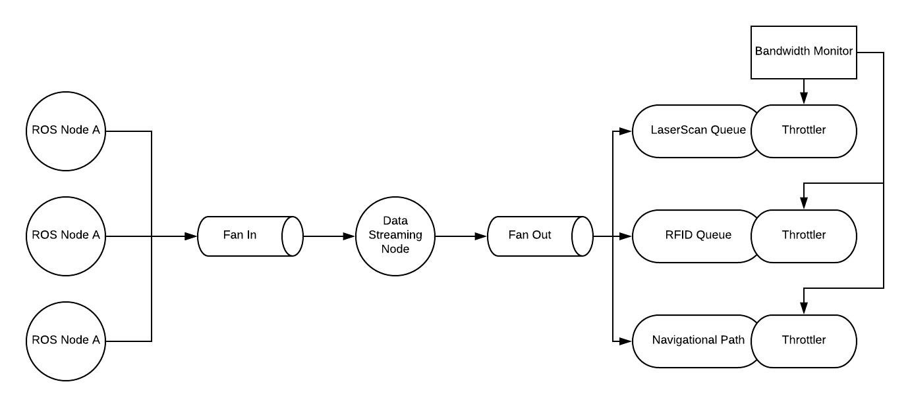

# IoRT - High Velocity Data Streaming

In recent years, robotics has become increasingly dependent on networking. It is safe to say that it
will be the internet of robotics things (IoRT) very soon. At Fetch Robotics, our robots are
coordinated by a central server. Sensory information and navigational statistics are streaming at a
lightning pace to our cloud infrastructures. The central server maintains a global state that oversees
the operation of a robotics fleet. Due to the physical limitation of robots in in our deployment site,
data streaming at a massive scale has been posed as a challenge to us.  

## Background

Robotic coordination relies on maintaining a real-time source of truth on the central server. This
source of truth is represented by the real-time data coming from robots’ sensor and navigational output.
Each robot is responsible for sending laser point clouds and planned trajectory for a navigational path.
Each message payload contains hundreds of float point data and is sent at the interval of 10 Hertz.
For production scale,, we often manage a fleet of hundreds of robots across multiple customer sites.

### Technology Stack

Traditionally, all of our robotic software is done in C++ and Python. The ecosystem of robotic
software is centered on ROS (Robotics Operating System.) The first class client libraries are written
in C++ and Python. It’s needless to say that C++ is preferred for its raw performance. Although
Python offers faster development time and greater flexibility, its performance is severely lacking
such that Python ROS client is most suitable for prototyping. Nevertheless, we still used Python
for many of our networking ROS node in the past.

#### ROS

In here, we must give a brief overview of what ROS is and how its architecture influences our decision
on adapting Golang to audience. ROS implements a computational graph where each node is a process
that performs computation.


Inside this multi-process communication framework, nodes are constantly exchanging data with one
another either through direct XMLRPC calls or long-lived TCP connections. One can easily extrapolate
that concurrency is heavily involved in the logic of message exchanging.

#### Data Streaming ROS Node

We have a data streaming node running on robot which is responsible for collecting data from other
ROS nodes and stream the data to the cloud. At any given time, it is managing multiple active TCP
connections to other data publishing nodes, meanwhile it is managing a connection to the cloud which
disconnects intermittently due to weak WiFi coverage in a particular area of a warehouse or limited
bandwidth on the router. It is an essential requirement for the streaming node that it must retry
and reconnect to server when its connection drops. Thus, concurrency is a massive overhead that we
are dealing with when we choose to write this node in C++ or Python.

### Constraints

Robots are suffering from the same constraint that is imposed on any mobile IoT devices. The
constraint is further exacerbated by the limited WiFi bandwidth in each customer site. Let’s add
concurrency management on top of all these problems. We have ourselves a comprehensive list of
difficulties.

- Prioritization of CPU usage
- Battery Management
- Low Bandwidth
- Intermittent Network Connectivity
- Threads Juggling

With all these constraints in mind, we must also factor into the velocity of development of features
on robots. As a startup, we simply cannot pause development and allocate resources into pure
optimization.  

## Go Robot

### Concurrency

Golang’s concurrency primitives have significantly alleviated our pain with dealing with concurrency,
without sacrificing too much performance. We need performance because we always have to keep CPU
usage and battery consumption in mind. We have implemented a Golang client for ROS, which is worth
another talk for its detailed implementation and live demonstration. We wrote a data streaming node
using `rosgo`.

In Python, we would expect to see the following callback pattern.

```python
import rospy
from threading import Lock
from std_msgs.msg import String

mutex = Lock()
message_batch = []

def callback(data):
    with mutex:
        message_batch.append(data)

def main():
    rospy.init_node('gopher')
    rospy.Subscriber('topic_1', String, callback)
    rospy.Subscriber('topic_2', String, callback)
    rospy.Subscriber('topic_3', String, callback)
```

Context switch is a killer in performance. The same logic can be done in Go without the need for
putting a thread into waiting state because Go runtime will take care of goroutine scheulding for us.

```golang
import (
    "rosgo"
    "time"
)

func main() {
    rosgo.InitNode("gopher")
    sub1 := rosgo.NewSubscriber("topic_1", rosgo.StringMessage)
    defer sub1.Unregister()

    sub2 := rosgo.NewSubscriber("topic_2", rosgo.StringMessage)
    defer sub2.Unregister()

    sub3 := rosgo.NewSubscriber("topic_3", rosgo.StringMessage)
    defer sub3.Unregister()

    batch := []ros.StringMessage{}
    timeout := time.After(10 * time.Second)
    for {
        select {
        case msg := <-fanIn(sub1.Register(), sub2.Register(), sub3.Register()):
            batch = append(batch, msg)
        case <-timeout:
            return
    }
}
```

More importantly, before the fan in operation, we can choose to perform parallel data manipulation
before we multiplex the data into the main goroutine. This section of the talk aims to address how
concurrency and parallelism is easily handled with Go.

### Data Compression

Traditionally we would send our data to the server by serializing it into JSON text. We have the
option of performing gzip compression on our JSON data, but it turns out that gzip compression works
even better on protobuf messages. Typically our payload size is on the order of kilobytes before
compression in JSON format. Using gzip to perform compression, we can get it down to one-third of
its original size. With gzipped protobuf messages, we can get it further down to one-fourth of its
original size. On top of that, we can default to use gRPC bidirectional streaming call easily in Go.

```golang
conn, err := grpc.Dial(":1234", grpc.WithInsecure())
if err != nil {
    log.Fatal(err)
}

cli := pb.NewDataStreamingClient(conn)

stream, err := client.PublishToDataStreams(context.Background())
if err != nil {
    log.Fatal(err)
}

for batch := range batchCh {
    payload := pb.DataPayload{Batch: batch}
    if err := stream.Send(&payload); err != nil {
        log.Error(err)
    }
}
```

This talk will evaluate gzipped JSON versus gzipped protobuf messages and show realworld data from
our findings on the gains we achieved.

### Message Prioritization

Robots are constantly moving inbetween WiFi access points in a warehouse. This introduces delays and
connectivity issues. Real world connectivity also means low bandwidth availability from one area to
the next. The challenge is when bandwidth shrinks or connection drops, what to do with the data we
batched?  

We tag our data with priorities. For example, the position of a robot cannot be compromised because
robotic orchestration relies on this centerpiece information to assign robots to appropriate tasks.
On the other hand, the location data of an inventory item can wait. The logic of controlling what
to send and when to wait can be easily done in Go with a bandwidth monitoring service that records
the amount of bytes sent to server over time. By monitoring connectivity in realtime, we're able to
use a combination of techniques to optimize for these constraints. This section of the talk will
focus on various message prioritization policies that we evaluated.



## Talk Format

1. [<1 mins] Speaker introduction
    - Who is the speaker?
    - What kind of software or solution is the speaker building with Go?
2. [3 mins] Robot Networking - the section aims to address the background and context of the problem
    - What does robot have to do with networking?
    - What kind of data are robots supposed to send to server?
    - Why are those data needed?
3. [2 mins] Mobile device challenges - the section aims to elaborate on the challenges
    - Why is sending data hard work?
    - What are the constraints and limitations imposed on robots in a warehouse?
4. [2 mins] Traditional ROS Approach - the section aims to address what is lacking in the current solution.
    - What’s wrong with C++ & Python on robot?
    - Why do we need concurrency on robot?
5. [15 mins] Go Robot - the section aims to provide a better solution.
    - How does the following keynotes address the challenges we face at Fetch?
        - Concurrency Pattern
        - Data Compression
        - Message Prioritization
6. [2 mins] Conclusion
    - Why you should consider Go when you build your next IoT mobile devices?
    - Summarize the success we have with adapting Go at Fetch Robotics.
